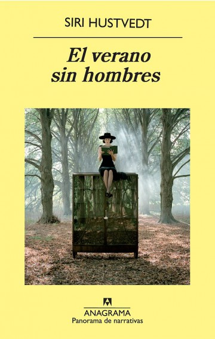

Conoce quién es [Hustvedt, Siri] (../Autores/HustvedtSiri)

Título | Autor/a | Género | Editor | Traducción |
------ | ------- | ------ | ------ | --------- |
Un verano sin hombres | Hustvedt, Siri | Narrativa  | Anagrama | Cecilia Ceriani |
***
|Sinopsis|
|--------|
Cuando Boris lzcovich dijo la palabra «pausa», Mia Fredricksen, de cincuenta y cinco años, que llevaba casada treinta con Boris, enloqueció. Porque lo que deseaba su marido era una pausa en su matrimonio, después de treinta años sin adulterios por parte de ninguna de las partes -aunque parezca increíble-, una hija encantadora que iniciaba su carrera de actriz y una relación entre ellos que había ido evolucionando desde el ardor guerrero de los primeros tiempos a la simbiosis casi telepática de los últimos. Hay que decir que la «pausa» de Boris es francesa, compañera de trabajo en el laboratorio -ambos son neurocientíficos-, joven y con buenas tetas. Pero la locura de Mia no fue más que una breve psicosis reactiva, y a la semana y media la dejaron marchar de la clínica donde había sido internada. Y éstos son los prolegómenos del verano en que Mia regresa a Sonden, la ciudad de su infancia, donde aún vive su madre en una residencia para ancianas activas e independientes.

Será un verano rabioso en lo personal y reflexivo en lo intelectual, porque Mia es poeta, con varios libros publicados. Alquila una casa, se relaciona con sus vecinos, una joven recién casada con dos niños y un marido que despierta en Mia sospechas de maltrato, y visita cada día a su madre, de más de ochenta años, y a su grupo de amigas, «los Cisnes», que son cinco -la mayor ya ha pasado los cien años y morirá en el curso del verano- y se mantienen activas, vivas e imbatibles. Y recupera los recuerdos de su infancia, y descubre algunos secretos de la femineidad de otras generaciones, como los tapices que borda en secreto una de los Cisnes, que esconden en bolsillos y pliegues ocultos escenas eróticas, o blasfemas, o acres burlas al mundo.

Mia también dirige un taller de poesía con un grupo de estudiantes en el instituto de Sonden. Y con la producción literaria de las adolescentes, la eclosión de su femineidad y sus crueles conspiraciones, las historias y las vidas de los viejos Cisnes y los incidentes del joven matrimonio, más su propia vida, Mia urde esta veloz, brillante comedia feminista, de inesperado final...

«Una irónica, brillante meditación sobre la identidad femenina, escrita en una prosa lírica, seductora» (Lucy Scholes, The Sunday Times).

«Una novela fuerte, provocadora, que hará que los lectores astutos se pregunten una vez más dónde está el límite entre la verdad y la ficción» (Stephenie Harrison, Book Page).

«El verano sin hombres es cómica, vital y brillante, aunque trate temas de vida o muerte» (Maria Russo, The New York Times).

«Una feminista que conjuga un gran talento literario y una vigorosa independencia intelectual. El verano sin hombres es una novela sutil y divertida; su protagonista -y tal vez su autora- ama a los hombres, pero no se engaña con respecto a ellos» (Michel Contat, Le Monde).
***
