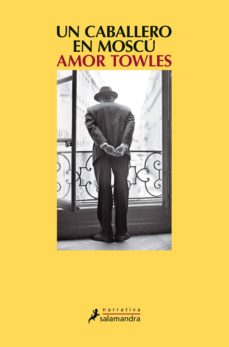

Conoce quién es [Towels, Amor] (../Autores/TowelsAmor)

Título | Autor/a | Género | Editor | Traducción |
------ | ------- | ------ | ------ | --------- |
Un caballero en Moscú | Towels, Amor | Fición histórica  | Salamandra | Gemma Rovira Ortega |
***
|Sinopsis|
|--------|
Aleksandr Rostov es un aristócrata que tuvo la oportunidad de escapar de Rusia después de la Revolución, pero decidió volver a su país, al que amaba por encima de todo. A su regreso, se instaló en el famoso Hotel Metropol, el más cosmopolita y prestigioso de Moscú, donde vivió cuatro años, de 1918 hasta 1922, cuando fue detenido por la Cheka y sometido a un juicio en el que todo apuntaba a que se le iba a condenar a muerte por estar su familia vinculada al régimen zarista. Sin embargo, como adquirió fama durante la Revolución por ser el autor de un famoso poema, le perdonaron la vida pero lo condenaron a vivir desde entonces recluido en el Metropol. Abandonó su lujosa suite y fue instalado en un olvidado y minúsculo desván.

Desde entonces, su vida está vinculada a la del hotel. Mantiene sus hábitos refinados y cultos. Es un experto en música, literatura y, sobre todo, gastronomía. Lleva una vida metódica. Frecuenta los restaurantes y bares y es muy apreciado por todos los trabajadores del hotel. Años después, es incluso contratado como maître del restaurante más lujoso. El conde se convierte en un testigo privilegiado del microcosmos del Metropol, símbolo y resumen también de la vida soviética durante cuatro décadas.

El libro está compuesto de muchas historias que revelan el carácter generoso, humano y enciclopédico del conde. Esas historias sirven para mostrar muchos aspectos de la vida rusa y muchos personajes y escenas variadas y entrañables.

En sus primeros años de reclusión, conoce a una niña de doce años con la que mantiene una divertidísima relación de amistad, que lleva a los dos a desentrañar muchos misterios y lugares ocultos del hotel, que la niña, Nina, conoce por sus ansias de aventura. Muchos años después, la hija de Nina, Sofía, marcará el destino del conde. La novela acaba con un final inesperado y sorprendente, otra muestra más del ingenio del noble.

La política soviética planea como telón de fondo por las páginas del libro y muchos sucesos de esas cruciales décadas pasan de refilón o adquieren un inusitado protagonismo. Todo siempre visto a través de la vida del conde y del elenco de personajes, la mayoría trabajadores del hotel, con los que se relaciona.

Aleksandr Rostov mantiene en todo momento su aureola de conde, de hombre educado, culto y refinado. Amante del lujo y la buena mesa, la gastronomía ocupa un lugar destacado en el libro, con descripciones detallistas y jugosas de platos rusos que deben servirse con el vino y los postres apropiados. También es una persona exquisita en sus gustos literarios y musicales, que transmite a la joven Sofía. El libro, voluminoso, está repleto de bellas y poéticas escenas, de momentos para la nostalgia, los recuerdos, la amistad, el compañerismo… y el intermitente amor. Todo ello escrito con una prosa amena y muy elegante, adaptada totalmente al espíritu delicado y profundamente humano del protagonista.
***
