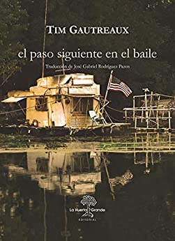

Conoce quién es [Tim, Gautreaux] (../Autores/TimGautreaux)

Título | Autor/a | Género | Editor | Traducción |
------ | ------- | ------ | ------ | --------- |
El paso siguiente en el baile | Tim, Gautreaux| Fición | La huerta grande | José Gabriel Rodríguez Pazos  |
***
Estará la editora: Phil Camino que es una mujer muy interesante. Para los que conocieron la librería "Los editores" era una de sus propietarias.

|Sinopsis|
|--------|
Del autor de la colección de relatos El mismo sitio, las mismas cosas, llega esta novela impregnada de un extraño y marcado sentido de la tradición y las nuevas oportunidades. Paul Thibodeaux es un atractivo joven casado con Colette, la mujer más hermosa del pequeño pueblo de Luisiana en el que crecieron.

Para Paul, la vida es plena, con una mujer a la que ama, máquinas que reparar, y un bullicioso local al que ir a bailar. Pero Colette aspira a más. Y cuando se desplaza a California en busca de una vida mejor, Paul la sigue para luego volver, a la es pera de que ella se replantee su vida junto a él.

Cómo llegan a darse cuenta de la importancia de su hogar y de su matrimonio hace de esta novela una aventura durante la cual tomará forma una historia de amor. Un retrato viviente de un lugar y una cultura poco explorados por la ficción contemporánea. Tim Gautreaux escribe con ingenio y compasión, pero también con un ojo clínico para los detalles de una vida al más puro estilo sureño.
***
