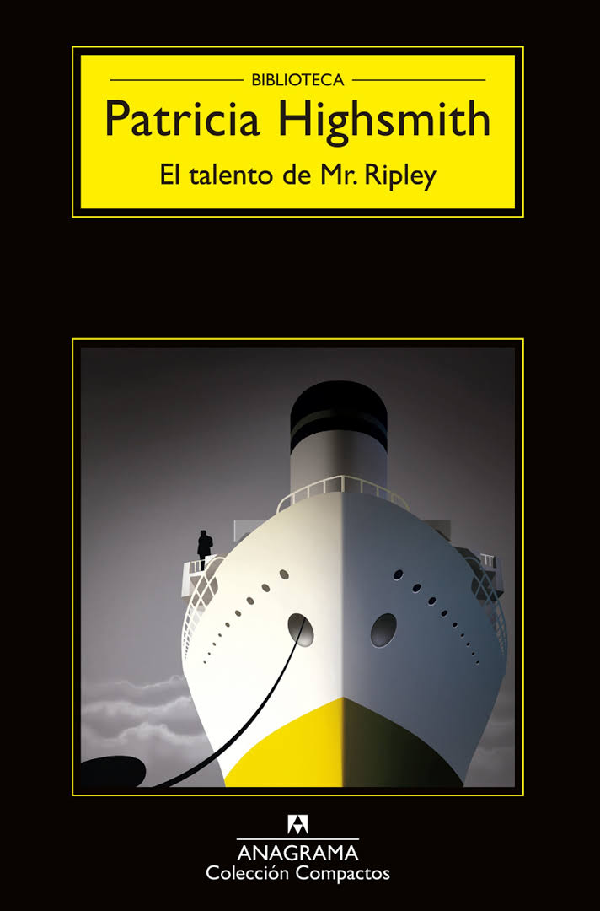

---
title: 2021-03-21 (18:00 por Skype) - El talento de Mr. Ripley / A pleno sol
subTitle: Highsmith, Patricia
category: "Seleccionado"
cover: ElTalentoDeMrRipley.jpg
---  
#### Participarán:
####    Sonia Sánchez Fariña (Licenciada en Filología Hispánica y especialista en Patricia Highsmith)  
####    Pablo Santiago Chiquero (Autor del excelente libro "Cervantes para cabras y Marx para ovejas" el cual fue objeto de nuestra tertulia del 7 de noviembre de 2019)  
---  
Conoce quién es [Highsmith, Patricia] (../Autores/HighsmithPatricia)

Título | Autor/a | Género | Editor | Traducción |
------ | ------- | ------ | ------ | --------- |
El talento de Mr. Ripley | Highsmith, Patricia | Fición | Anagrama | ¿Jordi Beltrán?  |
***
Tengo dudas respecto al traductor. Dado que ha habido varias ediciones no sé si habrá variación en este dato.
***

|Sinopsis|
|--------|
El talento de Mr. Ripley es una novela de Patricia Highsmith publicada en 1955. Se enmarca dentro del género negro-thriller psicológico y tiene lugar en su mayor parte en Europa. Fue escrita por la autora tras su primer viaje por el continente gracias al dinero ganado con los derechos de la película Extraños en un tren, adaptación de su primera novela homónima. En 1995, la Mystery Writers of America la incluyó en su lista de las cien mejores novelas de misterio de todos los tiempos.

Tom Ripley está pasando apuros para vivir en la gran ciudad, Nueva York, a pesar de su talento especial para hacer cualquier cosa para sobrevivir. Cuando el magnate Herbert Greenleaf le propone viajar a Italia para persuadir a su hijo, Dickie, a volver a los Estados Unidos y dirigir el negocio familiar, Ripley empieza a ver una oportunidad para construir desde los cimientos una nueva vida. Cuando llega a su destino y conoce a Dickie Greenleaf y a su novia Marge Sherwood, empieza una relación de amistad con ambos valiéndose de mentiras y artimañas (haciendo creer a Dickie que estudiaron en la misma universidad y que comparten la misma pasión por el jazz). Sin embargo, cuando Dickie empieza a cansarse de su compañía y de su dependencia, los sentimientos de Ripley se desmoronan al ver cómo puede desaparecer el nuevo estilo de vida al que se ha acostumbrado, por lo que tendrá que sacar de nuevo a florecer su talento para la supervivencia.
***
