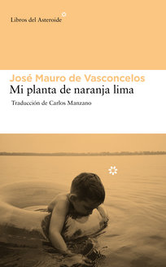

---
title: 2021-04-25 (18:00 por Skype) - Mi planta de naranja lima
subTitle: Mauro de Vasconcelos, José
category: "Seleccionado"
cover: MiPlantaDeNaranjaLima.jpg
---  
Conoce quién es [Mauro de Vasconcelos, José] (../Autores/MauroDeVasconcelosJosé)

Título | Autor/a | Género | Editor | Traducción |
------ | ------- | ------ | ------ | --------- |
Mi planta de naranja lima | Mauro de Vasconcelos, José | Fición | Asteroide | Carlos Manzano |
***
|Sinopsis|
|--------|
Mi planta de naranja lima (en portugués O Meu Pé de Laranja Lima) es una novela de José Mauro de Vasconcelos, una de las más leídas de la nueva literatura brasileña. El autor continúa la historia en Vamos a calentar el sol. Está narrada en primera persona y posee un altísimo nivel autobiográfico.
Encabezó la lista de superventas en 1968, año de su primera edición. Posteriormente, la novela fue traducida a 32 idiomas y publicada en 19 países. Ha sido adoptado como texto lectura a nivel de enseñanza primaria.
Tres telenovelas se han realizado sobre la base de esta obra: en 1970 para la Rede Tupi, y en 1980 y 1998 para la Rede Bandeirantes. También se han realizado varias adaptaciones al cine, televisión y teatro, siendo dirigida por Aurelio Teixeira la primera para el cine en 1970.2​ En el 2011 se ha presentado su segunda versión cinematográfica.3

Cuenta la vida de un niño de 5 años llamado Zezé, este es un niño muy travieso e independiente, el vive en una familia muy numerosa y pobre debido a que su padre no tiene empleo. Por este motivo se mudan. Cerca de la nueva vivienda en una canaleta encuentra una planta de naranja lima. Zezé la hace su amigo contándole su día a día.
A partir de ese momento se nos narran diversas peripecias en las que el lector conoce varias características de Zezé, entre las que destacan que es un niño inteligente pero travieso, ganándose el apodo de "niño diablo".
En sus diversas aventuras conoce a dos importantes personajes para la trama, estos son:
-Don Ariovaldo: Un vendedor ambulante de folletos de canciones al que coge cariño.
-Manuel Valadares: Un rico portugués que conduce un llamativo coche al que Zezé intenta subirse. El chico solamente consigue que el portugués le dé un escarmiento en público tras ser descubierto. Después de este incidente, Zezé conoce mejor a Manuel Valadares y acaba consagrándolo como su "Portuga", a quien querrá como a un padre hasta la muerte del portugués
***
