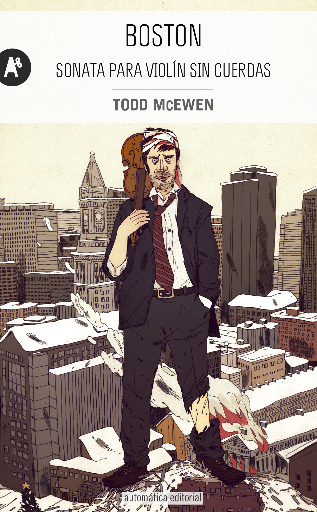

---
title: 2021-05-23 (18:00 por Skype) - Boston. Sonata para violín sin cuerdas
subTitle: McEwen, Todd
category: "Seleccionado"
cover: Boston.jpg
---  
Conoce quién es [McEwen, Todd] (../Autores/McEwenTodd)

Título | Autor/a | Género | Editor | Traducción |
------ | ------- | ------ | ------ | --------- |
Boston. Sonata para violín sin cuerdas | McEwen, Todd | Fición | Automática | Enrique Maldonado Roldán |
***
|Sinopsis|
|--------|
En Boston... McEwen nos cuenta la historia de un hombre del montón, cuya vida cambia por completo el día en que tiene una extraña visión mientras pasea por la laguna helada de Walden y, debido a un accidente de lo más tonto, se abre una brecha en la cabeza. A pesar de que la herida no es grave, el vendaje (increíblemente, siempre ensangrentado) y una mala suerte que nadie sabe de dónde viene harán no sólo que pierda su empleo y que su novia lo abandone, sino que lo arrastrarán a una serie de situaciones rocambolescas que acabarán como el Rosario de la Aurora.

A pesar de que este argumento puede parecer sencillo (simple, incluso) y aparentemente carente de mucho interés, Boston... es algo más que una historia graciosa (porque sí, esto también hay que reconocerlo, la novela es divertidísima) sobre un pobre tipo al que le pasa de todo. Boston... es también una ácida sátira y una crítica sobre la vida urbanita en general y sobre la ciudad de Boston en concreto, así como de la aparente necesidad actual de exhibir unos amplios conocimientos culturales (algo que hace el propio autor a lo largo de toda la novela).

Uno de los aciertos de este libro es que el estilo narrativo que utiliza McEwen se adapta como un guante a lo que nos quiere contar. En Boston... no vamos a encontrar la típica estructura "párrafo-diálogo-párrafo", sino que la voz del narrador se va a mezclar con las de los personajes (cuyas palabras han sido redactadas tal y como las escucharíamos en una conversación real, obviando cualquier respeto a las normas gramaticales), lo cual, aunque en un principio nos choque y nos hagan falta unas cuantas páginas para acostumbrarnos a ello, al final resulta ser una de las características por las que este libro merece ser recomendado.

En resumen, si alguien quiere pasar un buen rato, disfrutar de buena literatura y, además, aprender un poco acerca de Boston y leer sobrados argumentos para abandonar la ciudad y mudarse al monte, éste es su libro.
***
