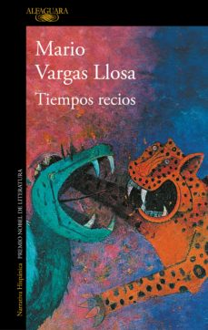

---
title: 2021-06-20 (18:00 por Skype) - Tiempos recios
subTitle: Vargas Llosa, Mario
category: "Seleccionado"
cover: TiemposRecios.jpg
---  
Conoce quién es [Vargas Llosa, Mario] (../Autores/VargasLlosaMario)

Título | Autor/a | Género | Editor | Traducción |
------ | ------- | ------ | ------ | --------- |
Tiempos recios | Vargas Llosa, Mario | Novela | Alfaguara | Original en castellano |
***
|Sinopsis|
|--------|
Una historia de conspiraciones políticas e intereses encontrados durante la Guerra Fría. Una mentira que pasó por verdad y cambió el devenir de América Latina.

«¿Era la historia esa fantástica tergiversación de la realidad?»

Guatemala, 1954. El golpe militar perpetrado por Carlos Castillo Armas y auspiciado por Estados Unidos a través de la CIA derroca el gobierno de Jacobo Árbenz. Detrás de este acto violento se encuentra una mentira que pasó por verdad y que cambió el devenir de América Latina: la acusación por parte del gobierno de Eisenhower de que Árbenz alentaba la entrada del comunismo soviético en el continente.

Tiempos recios es una historia de conspiraciones internacionales e intereses encontrados, en los años de la Guerra Fría, cuyos ecos resuenan hasta la actualidad. Un suceso que involucró a varios países y en el que algunos verdugos acabaron convirtiéndose en víctimas de la misma trama que habían ayudado a construir.

En esta novela apasionante, que conecta con la aclamadaLa Fiesta del Chivo, Mario Vargas Llosa funde la realidad con dos ficciones: la del narrador que libremente recrea personajes y situaciones, y la diseñada por aquellos que quisieron controlar la política y la economía de un continente manipulando su historia.
***
